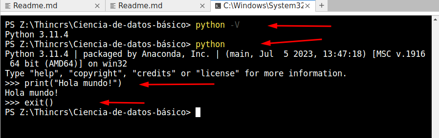
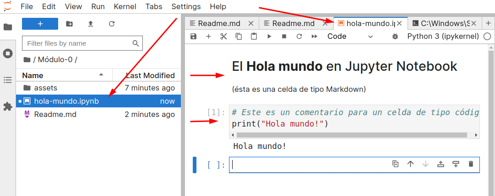
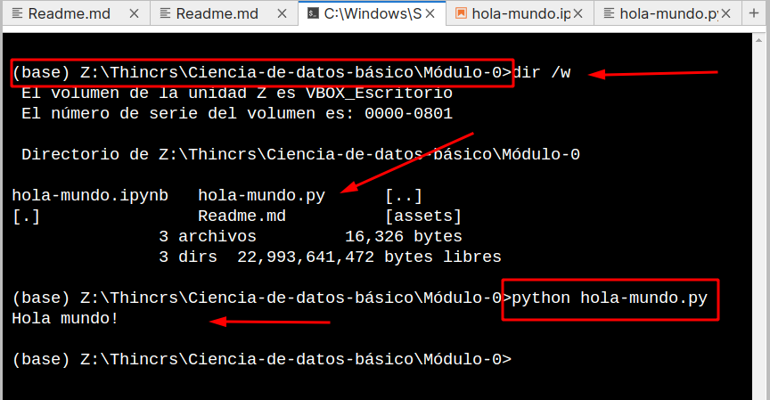

## Módulo 0: Introducción

### Presentación del curso

- Nombre: **Ciencia de Datos Básico con Python**
- Instructor:
  - **Nombre:** Ricardo Torres
  - **Email:** rictor@cuhrt.com
  - **Github:** https://github.com/rctorr
- Espeicifcaciones del curso:
  - Días de sesión: Martes y jueves 
  - Horario: 18:00 a 20:00 pm. 
  - Duración: 13 de agosto al 12 de septiembre
  - No. de sesiones: 10 sesiones
- Nivel del curso: Básico
- Asistencia:
  - Se realizará a los 15 min de iniciada la clase
- Para comunicar ausencias enviar mensaje a:
  - Instructor
  - educacion@thincrs.com
- Dinámica de clase:
  - Teoría 20%
  - Ejemplos 80%
- Evaluación final y entrega de retos:
  - La evaluación final se realizará en la última sesión y será mediante una serie de preguntas.
  - También desarrollarán un proyecto a lo largo del curso que implica resolver varios retos, el resultado de cada reto se puede entregar a partir de la sesión siguiente a donde se hayan visto los temas para resolverlo y se irá comentando en clase.
- Medio de comunicación:
  - ¿Correo electrónico, whats, telegram, discord, slack?
- Clases grabadas en plataforma
  - Las clases serán grabadas y puestas a disposición en la plataforma.
 
### Preparación de Herramientas

- Lenguaje de programación Python
  - Sitio oficial: https://www.python.org
  - Anaconda Python: https://www.anaconda.com
  - Miniconda Python: https://docs.conda.io/en/latest/miniconda.html
  - Instalando Miniconda Python
  - Obteniendo la versión de Python
  - Iniciando el intérprete de Python y ejecutando el 1er "Hola mundo!"
  - Saliendo del intérprete de Python
    


- Hambiente de desarrollo (IDE) Jupyter-Lab
  - Sitio oficial: https://jupyter.org
  - Instalando Jupyter Lab
  - Ejecutando Jupyter Lab
  - Creando un cuaderno de trabajo (notebook) y conociendo Jupyter Lab
  - Creando una celda de texto (Markdown)
  - Creando una celda de código y ejecutando el 2do "Hola mundo!"
  - Saliendo de Jupyter Lab
 


- (Extra) Ejecutando un script de Python
  - Selecciona el cuaderno de jupyter
  - Seleccionar la opción del menú File > Save and Export Notebook as > Executable Script y deja el mismo nombre `hola-mundo.py`
  - Sube el archivo a la carpeta de trabajo `Módulo-0/`
  - Edita el archivo dando doble click
  - Elimina todo lo que no sea útil quedando algo similar a lo siguiente:
```python
#!/usr/bin/env python
# coding: utf-8

print("Hola mundo!")
```
  - Selecciona o abre una terminal desde Jupyter Lab
  - Cambia a la unidad y directorio hasta llegar a la carpeta `Módulo-0/`
  - Ejecuta tu script con `python <nombre-del-script>`



 

