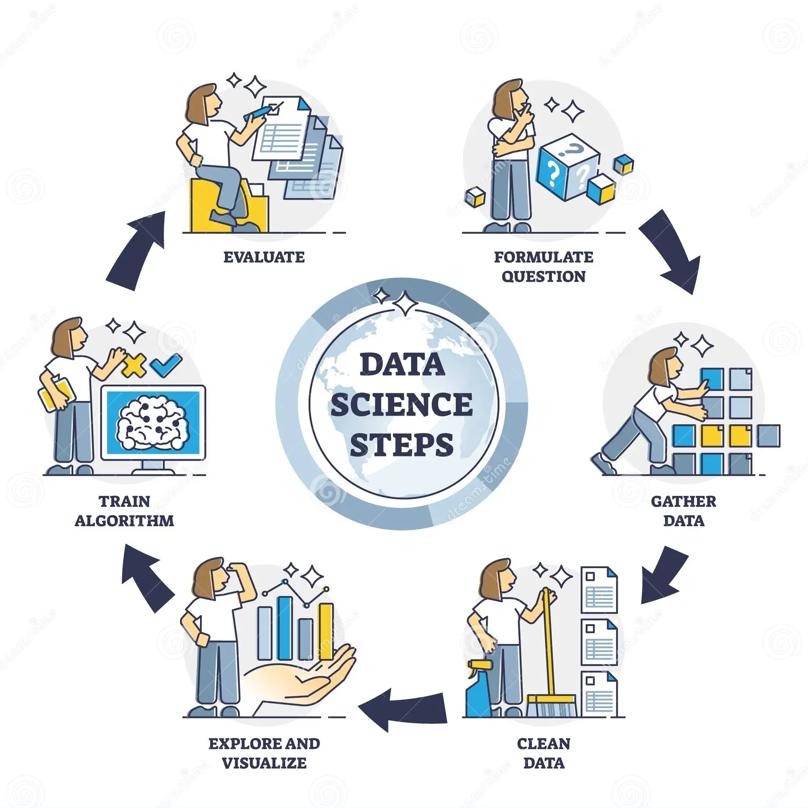

## Módulo 1: ¿Qué es la Ciencia de Datos?

- Ciencia de datos es la disciplina que extrae conocimiento de los datos. Se basa en la informática (para estructuras de datos, algoritmos, visualización, soporte de big data y programación general), la estadística (para regresiones e inferencias) y el conocimiento del dominio (para formular preguntas e interpretar resultados).
- La ciencia de datos tradicionalmente se ocupa de una serie de temas dispares, incluyendo bases de datos, análisis de texto, análisis de datos numéricos, análisis de redes complejas, visualización de datos, aprendizaje automático, procesamiento de series temporales y análisis de big data.
- Independientemente del tipo de análisis, **la ciencia de datos es primero ciencia y luego magia**. Como tal, es un proceso que sigue generalmente una secuencia.

### Secuencia del proceso de Ciencia de Datos

1. **Definición del problema.** El primer paso es definir el problema que se quiere resolver. Esto implica entender el contexto del problema, los datos disponibles y los objetivos que se quieren lograr.
1. **Recopilación de datos.** Una vez que se ha definido el problema, el siguiente paso es recopilar los datos necesarios. Esto puede implicar recopilar datos nuevos o utilizar datos que ya estén disponibles.
1. **Limpieza y preparación de datos.** Los datos recopilados deben limpiarse y prepararse antes de poder ser utilizados. Esto implica eliminar datos incorrectos o faltantes, y transformar los datos para que estén en un formato adecuado para el análisis.
1. **Análisis de datos.** El siguiente paso es analizar los datos para identificar patrones y tendencias. Esto puede implicar utilizar técnicas estadísticas, de aprendizaje automático o de visualización de datos.
1. **Presentación de resultados.** El último paso es presentar los resultados del análisis a los stakeholders. Esto implica comunicar los hallazgos del análisis de una manera clara e informativa.

El proceso puede variar en función del problema específico que se está tratando, pero estos pasos son generalmente comunes a todos los proyectos de ciencia de datos.

### Reporte de resultados

El informe del proyecto es lo que nosotros (científicos de datos) enviamos al cliente (interno o externo). El informe suele incluir lo siguiente:

- El informe suele incluir un resumen, una introducción, los métodos utilizados para la adquisición y procesamiento de datos, los resultados obtenidos, una conclusión y un apéndice.
- El apéndice contiene todo el código reproducible utilizado para procesar los datos, así como los datos sin procesar que se utilizaron para crear el informe.
- El informe del proyecto debe ser claro, conciso y fácil de entender.
- El informe del proyecto debe ser reproducible, es decir, debe ser posible volver a crear los resultados del análisis utilizando los datos y el código proporcionados en el informe.

### Ejemplo

Durante el inicio del curso se les compartió un formulario para conocer el perfil de los asistentes ¿sería posible generar un pequeño proceso de Ciencia de Datos con los datos recabados?
